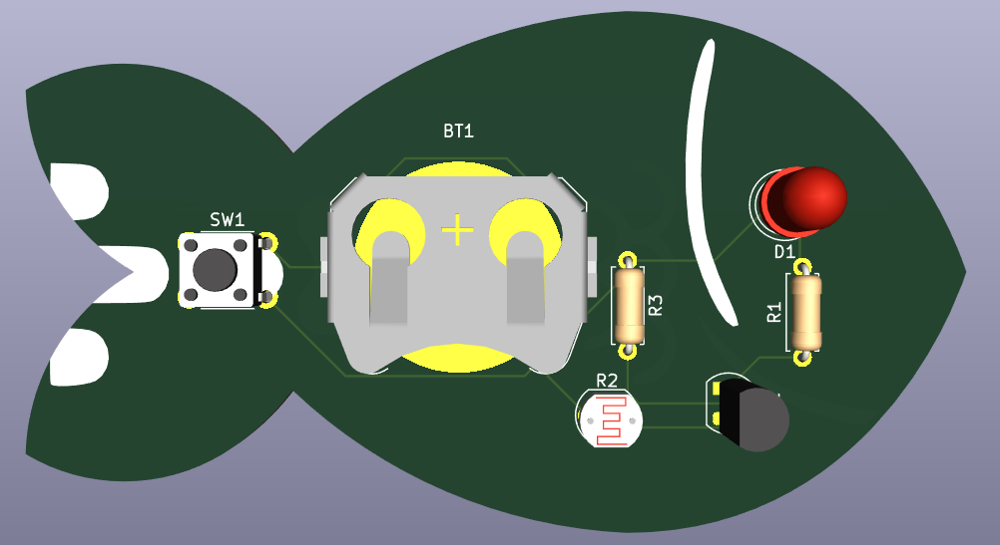

# mcfish

- [mcfish](#mcfish)
  - [Images](#images)
    - [Schematic (KiCad)](#schematic-kicad)
    - [Schematic (Falstad)](#schematic-falstad)
      - [When its darker (simulated by a higher resistance)](#when-its-darker-simulated-by-a-higher-resistance)
      - [When its lighter (simulated by a lower resistance)](#when-its-lighter-simulated-by-a-lower-resistance)
    - [PCB (KiCad)](#pcb-kicad)
      - [2D view](#2d-view)
      - [3d view](#3d-view)
  - [Bill of materials](#bill-of-materials)

Tis a non fishy fishy made in KiCad, made by @skifli in the Slack. Its consists of an LED which emits light when the switch is on, and will be brighter when the photoresistor detects it is darker (and vice versa). There are no errors when checking with DRC, and it works in Falstad (see below).

## Images

### Schematic (KiCad)

### Schematic (Falstad)

#### When its darker (simulated by a higher resistance)

#### When its lighter (simulated by a lower resistance)

### PCB (KiCad)

#### 2D view

#### 3d view

## Bill of materials

Ripped from `/production/bom.csv`

| Designator | Footprint                                        | Quantity | Value        | LCSC Part # |
| ---------- | ------------------------------------------------ | -------- | ------------ | ----------- |
| BT1        | BatteryHolder_Keystone_3034_1x20mm               | 1        | Battery_Cell |             |
| D1         | LED_D5.0mm                                       | 1        | LED          |             |
| Q1         | TO-92L_HandSolder                                | 1        | NPN          |             |
| R1, R3     | R_Axial_DIN0207_L6.3mm_D2.5mm_P7.62mm_Horizontal | 2        | R            |             |
| R2         | R_LDR_5.1x4.3mm_P3.4mm_Vertical                  | 1        | R_Photo      |             |
| SW1        | SW_PUSH_6mm                                      | 1        | SW_Push      |             |
